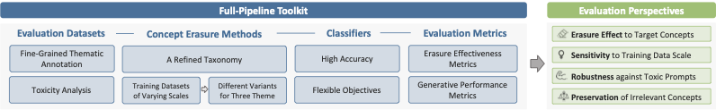
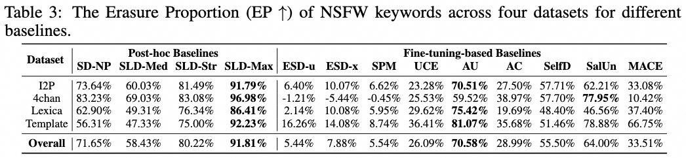
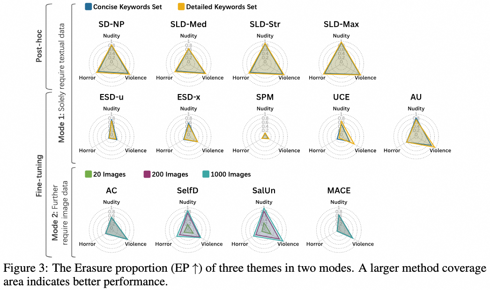
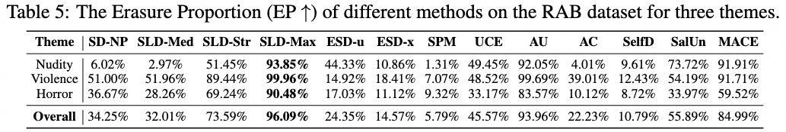
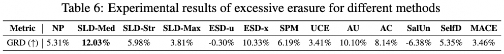
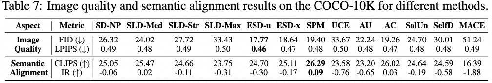

# Comprehensive Assessment and Analysis for NSFW Content Erasure in Text-to-Image Diffusion models

## Introduction

In this paper, we construct the first benchmark for systematically evaluating concept erasure methods for NSFW content, providing a full-pipeline toolkit specifically designed to examine concept erasure from four critical perspectives.




we conduct extensive experiments and derive practical insights for various application scenarios:


1. We begin with an overall performance comparison among various concept erasure methods. Our findings suggest that post-hoc correction methods are well-suited for resource-constrained scenarios due to their efficiency. However, these methods may encounter robustness issues in high-security scenarios where users might easily circumvent safety mechanisms.


2. We evaluate method variants across diverse NSFW themes and data scales. The results indicate that blindly increasing the data scale yields limited benefits for most methods. Moreover, strategies that are highly sensitive to data scale, such as unlearning techniques or introducing additional trainable parameters, should be avoided when training data is limited.


3. We also assess the robustness of the methods against toxic prompts, demonstrating that adversarial training significantly enhances resilience, while methods that focus on the model's image-level understanding can also achieve satisfied performance.


4. We investigate how concept erasure affects the preservation of unrelated concepts, which reveals that improved erasure effectiveness often compromises overall generation quality, highlighting the necessity to carefully balance this trade-off during model configuration.




## Usage
```
git clone repo
pip install -r requirements.txt
```

**Image generation using different baseline methods**

1. Place the trained model weights in the `models` directory. Refer to `method/def.py` for detailed specifications.
2. Run `method/generate.py` to generate images. Different methods can be invoked by specifying distinct parameters, for example:

```
python generate.py --steps 40 --device "cuda" --evaluation_task "i2p" --erase_target "Nudity" --method "SalUn" --version_ec 200 
```
3. Generated images will be saved to the `results` directory.

**Evaluation**
1. We provide all evaluation tool code in the `evaluate` directory. If you use our method to generate images, the evaluation scripts have pre-configured paths. You only need to specify the method name and evaluation task in the code. Otherwise, you must adjust the result directory paths according to your own output structure. We believe this process is straightforward.